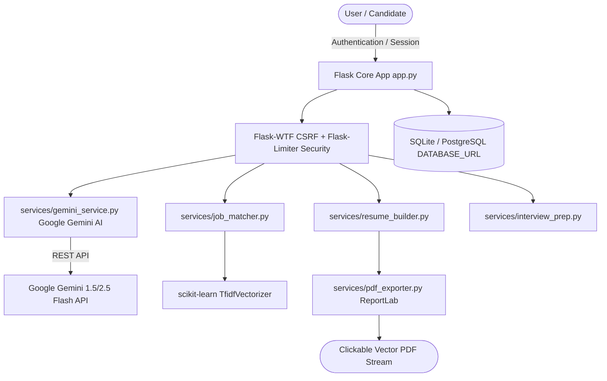

# ResumeAI V2 — Production-Ready AI Career Platform & Job Matcher

[](https://www.python.org/)
[](https://flask.palletsprojects.com/)
[](https://aistudio.google.com/)
[](https://scikit-learn.org/)
[](https://www.reportlab.com/)
[]()

> **Production-Ready Portfolio Project for B.Tech CSE (Artificial Intelligence / Software Engineering)**  
> An enterprise-grade, server-rendered AI SaaS platform offering **Hybrid AI Job Matching (Scikit-Learn TF-IDF + Google Gemini LLM)**, **Structured ATS Resume Builder**, **Clickable PDF Link Exporter**, **AI Cover Letter Generator**, **Floating AI Career Coach Chatbot**, **Live Technical Interview Evaluator**, and **Docker Production Deployment**.

---

## 📌 Executive Summary

**ResumeAI V2** bridges the gap between student/jobseeker resumes and modern hiring ATS software. It provides candidates with explainable AI evaluations, multi-version resume management, hybrid statistical and LLM job matching, AI-assisted bullet point rewriting, and real-time career coaching—all built cleanly in Python, Flask, Jinja2, scikit-learn, Google Gemini AI, and pure CSS3.

---

## ✨ Key Platform Capabilities

1. ⚡ **Google Gemini AI Upgrade (Hybrid Architecture)**:
   - **Floating AI Career Coach Chatbot**: Real-time interactive AI mentor available on every page.
   - **AI Cover Letter Generator**: Generates 3-paragraph executive cover letters tailored to target job descriptions.
   - **Live Interview Answer Assessor**: Evaluates candidate answers with 0-100 scores, strengths, and missing keywords.
   - **Multi-Style Bullet Rewriter**: Produces Quantifiable Metric, Action-Verb, and Technical Depth bullet variations.
   - **Zero-Downtime Fallback**: Uses local Scikit-Learn NLP automatically if `GEMINI_API_KEY` is not present.

2. 🛠️ **Structured ATS Resume Builder & Clickable PDF Exporter**:
   - Centered Header, section underline rules, right-aligned dates, and clickable `GitHub` | `Live Demo` | `LinkedIn` | `Portfolio` links.
   - Precision 0.5-inch margins for ATS readability.
   - Export high-quality selectable vector PDFs using `ReportLab`.

3. 🔐 **Production Security Hardening**:
   - `Flask-WTF` CSRF protection across all state-changing forms.
   - `Flask-Limiter` endpoint rate limits (`/login`, `/register`, `/upload`, `/job-matcher`, `/rewriter`).
   - Magic byte PDF header validation (`%PDF-`) and strict owner authorization checks.

4. 🧠 **Hybrid AI Job Matching Engine**:
   - Combines statistical term matching with TF-IDF cosine similarity:
     $$\text{Hybrid Match Score} = 0.35(\text{Skill Overlap}) + 0.35(\text{TF-IDF Similarity}) + 0.30(\text{Keyword Density})$$

5. 📊 **Side-by-Side Resume Comparison**:
   - Compare two resume versions side-by-side on skill density, project coverage, and overall quality scores.

6. 🐳 **Docker & Cloud WSGI Production Deployment**:
   - Includes `Dockerfile`, `docker-compose.yml`, `Gunicorn` WSGI setup, `/health` endpoint, and dynamic `PostgreSQL` / `SQLite` database support.

---

## 📐 System Architecture



---

## 🚀 Quick Setup & Installation Guide

### 1. Clone & Setup Virtual Environment
```bash
git clone https://github.com/YOUR_USERNAME/resume-ai-analyzer.git
cd resume-ai-analyzer

python -m venv venv
# On Windows PowerShell:
venv\Scripts\activate
# On Linux/macOS:
source venv/bin/activate

pip install -r requirements.txt
```

### 2. Configure Environment Variables
Copy `.env.example` to `.env` and add your Google Gemini API Key from [Google AI Studio](https://aistudio.google.com/):
```env
SECRET_KEY=resumeai-v2-super-secret-key-2026-production
FLASK_ENV=development
GEMINI_API_KEY=AIzaSy...
```

### 3. Initialize Database & Run Server
```bash
python app.py
```
Navigate to [http://127.0.0.1:5000](http://127.0.0.1:5000)

### 4. Run Unit Tests
```bash
python -m unittest discover -s tests
```

---

## 🗄️ Database Schema

```sql
CREATE TABLE users (
    id SERIAL PRIMARY KEY,
    name TEXT NOT NULL, email TEXT UNIQUE NOT NULL, password_hash TEXT NOT NULL,
    created_at TIMESTAMP DEFAULT CURRENT_TIMESTAMP
);

CREATE TABLE profiles (
    user_id INTEGER PRIMARY KEY REFERENCES users(id) ON DELETE CASCADE,
    college TEXT, degree TEXT, branch TEXT, graduation_year INTEGER,
    phone TEXT, target_role TEXT, github_url TEXT, linkedin_url TEXT
);

CREATE TABLE resume_versions (
    id SERIAL PRIMARY KEY,
    user_id INTEGER NOT NULL REFERENCES users(id) ON DELETE CASCADE,
    version_name TEXT NOT NULL, target_role TEXT DEFAULT 'Software Engineer',
    summary TEXT, contact_info_json TEXT, education_json TEXT, skills_json TEXT,
    experience_json TEXT, projects_json TEXT, certifications_json TEXT,
    template_name TEXT DEFAULT 'ats_classic',
    created_at TIMESTAMP DEFAULT CURRENT_TIMESTAMP, updated_at TIMESTAMP DEFAULT CURRENT_TIMESTAMP
);

CREATE TABLE analyses (
    id SERIAL PRIMARY KEY,
    user_id INTEGER NOT NULL REFERENCES users(id) ON DELETE CASCADE,
    resume_version_id INTEGER REFERENCES resume_versions(id) ON DELETE SET NULL,
    resume_filename TEXT NOT NULL, resume_score INTEGER NOT NULL,
    job_title TEXT, company_name TEXT, job_match_score INTEGER, recommended_role TEXT,
    analysis_json TEXT NOT NULL, created_at TIMESTAMP DEFAULT CURRENT_TIMESTAMP
);
```

---

## 📜 License & Disclaimer

*ResumeAI V2 provides automated resume quality analysis, hybrid TF-IDF + Gemini AI matching, and career preparation tools for educational and portfolio demonstration purposes.*
